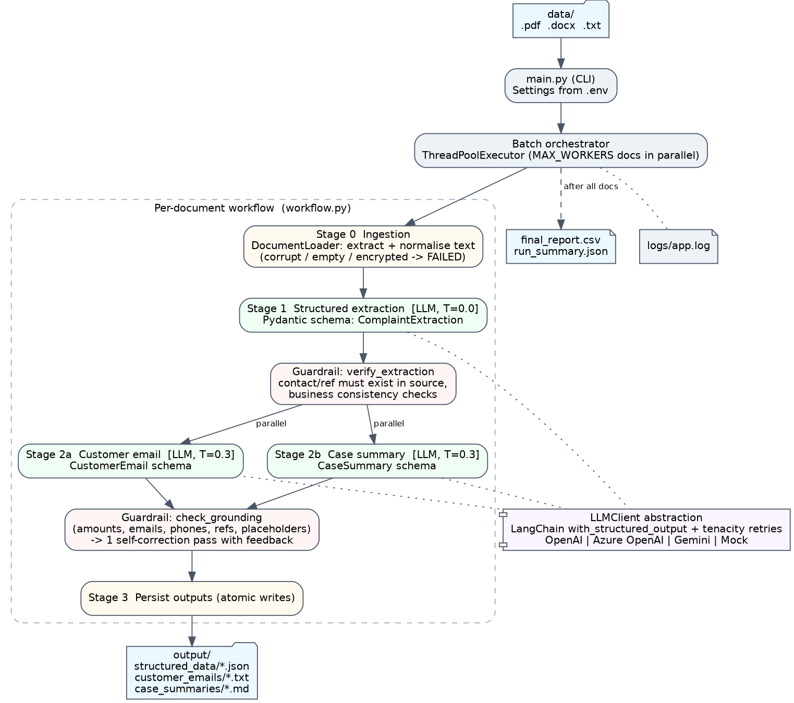
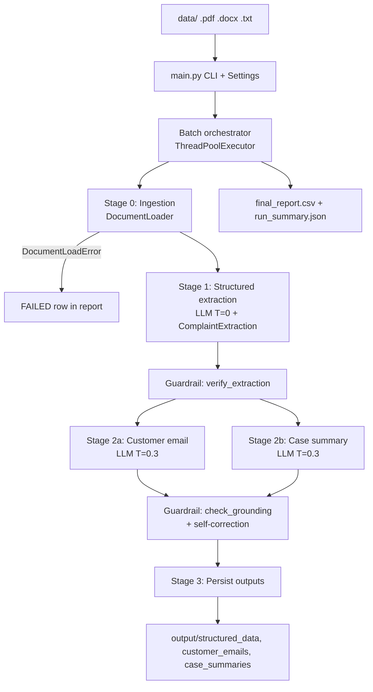

# AI-Powered Customer Complaint & Case Processing Workflow

**GenAI Development Program – Final Evaluation – Project 1**
*AI-Powered Document Processing & Business Workflow*

A batch GenAI workflow that reads customer complaint documents (`.pdf`, `.docx`, `.txt`) from a local `data/` folder and, for every document, runs three separate LLM tasks: **structured extraction** (Pydantic-validated), a **customer response email**, and an **internal management case summary**. Results are written per document and consolidated into `final_report.csv`.

---

## 1. Problem Statement

Customer-care teams receive complaints in many formats (intake forms, emails, chat transcripts, letters). Reading each one, capturing the key facts into a case system, drafting a reply and briefing management is slow, repetitive and inconsistent. The goal is to automate this with an LLM workflow that produces **structured, validated, grounded** outputs rather than free-form text, and that keeps working when individual files are broken.

## 2. Solution Overview

| Requirement (brief) | How it is implemented |
|---|---|
| Ingest ≥2 formats, batch, graceful errors | `ingestion.py` supports **.pdf, .docx, .txt**; handles empty, corrupt, encrypted, oversized, image-only and unsupported files without stopping the batch |
| Structured extraction with a defined schema | `ComplaintExtraction` Pydantic model passed to the LLM via LangChain `with_structured_output` (JSON-schema mode). Enums (`Literal`) for category, status, priority and Yes/No fields; validators normalise drift |
| Not just raw LLM output | Output is parsed into Pydantic objects, **verified against the source** (`guardrails.py`) and only then persisted |
| Customer response email | `CustomerEmail` schema; prompt forbids invented facts; **grounding check + self-correction** loop removes hallucinated amounts, references, phone numbers, emails and placeholders |
| Internal case summary | `CaseSummary` schema with overview, key issue, action taken, current status, recommended next action |
| Workflow orchestration | Separate tasks, explicit stages: ingestion → extraction → **(email ‖ summary in parallel)** → persist |
| Batch processing | Documents processed concurrently with a thread pool (`MAX_WORKERS`) |
| Output structure | `output/structured_data/`, `customer_emails/`, `case_summaries/`, `final_report.csv` (+ `run_summary.json`) |
| Engineering practices | `.env` configuration, logging to console + rotating file, retries with exponential backoff, 46 automated tests + a verification harness, CI workflow |

## 3. Architecture





**Why stage 2 is parallel:** the email and the summary both depend on the extraction but not on each other, so they are fanned out concurrently. A failure in one does not discard the other (document status `PARTIAL`).

**Per-document statuses:** `SUCCESS` (all three tasks) · `PARTIAL` (extraction OK, email or summary failed) · `FAILED` (ingestion or extraction failed) · `SKIPPED` (unsupported file type). Every input file gets a row in the final report.

## 4. Technology Stack

| Area | Technology |
|---|---|
| Language | Python 3.10+ |
| LLM integration | LangChain (`langchain-openai`, `langchain-google-genai`) |
| LLM providers | OpenAI, Azure OpenAI, Google Gemini (free tier), offline Mock |
| Structured output | Pydantic v2 + `with_structured_output` (JSON schema) |
| Document parsing | `pypdf`, `python-docx` |
| Resilience | `tenacity` (exponential backoff), per-document error isolation |
| Concurrency | `concurrent.futures.ThreadPoolExecutor` (two levels) |
| Config | `python-dotenv` + typed `Settings` dataclass |
| Testing / CI | `pytest`, GitHub Actions |

## 5. Project Structure

```
genai-complaint-workflow/
├── main.py                       # CLI entry point
├── complaint_processor/
│   ├── config.py                 # Settings from .env, validation
│   ├── logging_setup.py          # console + rotating file logs
│   ├── ingestion.py              # discover + read .pdf/.docx/.txt, file-level errors
│   ├── schemas.py                # Pydantic schemas + result models
│   ├── prompts.py                # prompt templates (one per task)
│   ├── guardrails.py             # source verification + grounding checks
│   ├── tasks.py                  # the three AI tasks
│   ├── workflow.py               # orchestration, parallelism, batch
│   ├── writers.py                # per-document outputs, CSV report, run summary
│   └── llm/
│       ├── base.py               # provider-agnostic LLMClient interface
│       ├── langchain_client.py   # structured output + retries
│       ├── factory.py            # OpenAI / Azure OpenAI / Gemini / Mock
│       └── mock_client.py        # offline heuristic client (testing only)
├── scripts/generate_sample_data.py
├── scripts/verify_submission.py  # automated end-to-end verification + packaging
├── data/                         # 8 sample complaints + 3 error-case files
├── output/                       # generated results (sample outputs)
├── docs/architecture.png | .dot, docs/demo_script.md
├── evaluation/expected_results.json  # labelled ground truth for acceptance checks
├── tests/                        # 46 pytest tests
├── .github/workflows/ci.yml
├── requirements.txt, pytest.ini, .env.example, .gitignore
```

## 6. Setup Instructions

```bash
# 1. Clone and enter the project
git clone <your-repo-url> genai-complaint-workflow
cd genai-complaint-workflow

# 2. Create a virtual environment
python -m venv .venv
# Windows (PowerShell):  .venv\Scripts\Activate.ps1
# macOS / Linux:         source .venv/bin/activate

# 3. Install dependencies
pip install -r requirements.txt

# 4. Configure environment
cp .env.example .env          # Windows: copy .env.example .env
# edit .env: set LLM_PROVIDER and the matching API key
```

## 7. Environment Variables

| Variable | Required | Default | Description |
|---|---|---|---|
| `LLM_PROVIDER` | yes | `openai` | `openai`, `azure_openai`, `gemini` or `mock` |
| `MODEL_NAME` | no | provider default | `gpt-4o-mini` (OpenAI), `gemini-2.5-flash` (Gemini) |
| `OPENAI_API_KEY` | for `openai` | – | OpenAI key |
| `OPENAI_BASE_URL` | no | – | Any OpenAI-compatible endpoint |
| `AZURE_OPENAI_ENDPOINT` / `_API_KEY` / `_DEPLOYMENT` | for `azure_openai` | – | Azure OpenAI resource, key and deployment name |
| `AZURE_OPENAI_API_VERSION` | no | `2024-10-21` | API version (must support structured outputs) |
| `GOOGLE_API_KEY` | for `gemini` | – | Free key from Google AI Studio |
| `EXTRACTION_TEMPERATURE` / `GENERATION_TEMPERATURE` | no | `0.0` / `0.3` | `none` for models that reject temperature |
| `MAX_WORKERS` | no | `3` | Documents processed in parallel |
| `LLM_MAX_RETRIES` / `LLM_TIMEOUT_SECONDS` | no | `3` / `60` | Retry and timeout per LLM call |
| `MAX_FILE_SIZE_MB` / `MAX_DOCUMENT_CHARS` | no | `10` / `20000` | Input limits |
| `GROUNDING_MAX_CORRECTIONS` | no | `1` | Self-correction attempts for ungrounded text |
| `COMPANY_NAME` / `EMAIL_SIGNATURE` | no | Contoso | Branding in customer emails |
| `DATA_DIR` / `OUTPUT_DIR` / `LOG_DIR` / `LOG_LEVEL` | no | `data` / `output` / `logs` / `INFO` | Paths and logging |

API keys live only in `.env`, which is git-ignored. Never commit it.

## 8. How to Run

```bash
# Full run with the provider configured in .env
python main.py --clean

# Offline dry-run (no API key, no cost) - verifies the whole pipeline
python main.py --provider mock --clean

# Other options
python main.py --provider gemini --workers 2 --log-level DEBUG
python main.py --data-dir my_docs --output-dir my_output

# Regenerate the sample input documents
python scripts/generate_sample_data.py

# Run the test suite
pytest
```

The console prints a per-file summary table; detailed logs go to `logs/app.log`.

## 9. Sample Inputs (`data/`)

| File | Format | Scenario | Tests |
|---|---|---|---|
| complaint_001.pdf | PDF form | Credit card double charge, refunded | Resolved case, attachments |
| complaint_002.docx | Word letter | 6-day internet outage, threatens regulator | Escalation, agent notes |
| complaint_003.txt | Email thread | Washing machine delivered damaged | In-progress case |
| complaint_004.pdf | PDF intake | Unauthorised debit transactions | Fraud, Critical priority |
| complaint_005.docx | Word form (table) | Rude branch staff, manager apologised | DOCX tables, closed case |
| complaint_006.txt | Web form | Compliment + loyalty points question | **Non-complaint** (Complaint = No) |
| complaint_007.pdf | PDF letter | Delayed auto insurance claim | Pending customer response, **prompt-injection attempt** |
| complaint_008.txt | Chat transcript | Disputed roaming charges | Informal text, no email address |
| complaint_009_corrupted.pdf | – | Invalid PDF bytes | Error handling → FAILED |
| complaint_010_empty.txt | – | 0-byte file | Error handling → FAILED |
| customer_list.csv | – | Unsupported format | Error handling → SKIPPED |

All names, emails, phone numbers and reference numbers are fictional.

## 10. Sample Outputs (`output/`)

- `structured_data/<doc>.json` – validated extraction plus metadata (provider, model, prompt version, run id, validation warnings)
- `customer_emails/<doc>.txt` – subject line and email body
- `case_summaries/<doc>.md` – header table + the five summary sections
- `final_report.csv` – one row per input file: all extracted fields, status, output paths, warnings, errors, LLM calls, tokens, processing time
- `run_summary.json` – counts by status, category, case status and priority, escalations, total tokens

Example (`structured_data/complaint_003.json`, abridged):

```json
{
  "source_file": "complaint_003.txt",
  "llm_provider": "openai",
  "extraction": {
    "customer_name": "Meera Joshi",
    "email": "meera.joshi@example.org",
    "phone_number": "416-555-0173",
    "reference_number": "ORD-448120",
    "complaint_category": "Delivery & Shipping",
    "is_complaint": "Yes",
    "escalation_required": "No",
    "supporting_document_available": "Yes",
    "overall_case_status": "In Progress",
    "priority": "Medium"
  },
  "validation_warnings": []
}
```

## 11. Key Design Decisions

1. **Three focused LLM calls, not one mega-prompt.** Each task has its own prompt, schema and temperature. This makes each step testable, lets the email and summary run in parallel, and isolates failures.
2. **Schema-first structured output.** Pydantic models are sent to the model as a JSON schema; `Literal` enums constrain categories and statuses. Field descriptions act as field-level instructions. `include_raw=True` exposes parsing errors (which are retried) and token usage.
3. **Deterministic guardrails after the LLM.** Contact details and reference numbers must literally appear in the source or they are removed (`Not Provided`) with a warning. Business-consistency checks flag contradictions (e.g. escalated but resolved) for human review.
4. **Grounding check with self-correction.** Generated emails and summaries are scanned for amounts, references, phone numbers, emails and template placeholders absent from the source. If found, the issues are fed back to the model for one rewrite; remaining issues are reported, never silently shipped.
5. **Prompt-injection defence.** Documents are wrapped in `<document>` tags and declared untrusted; `complaint_007.pdf` contains an injection attempt to demonstrate it.
6. **Provider-agnostic `LLMClient` interface.** OpenAI, Azure OpenAI and Gemini are a config change. The mock client lets the full pipeline (and CI) run without keys.
7. **Two temperatures.** `0.0` for extraction (deterministic), `0.3` for writing (natural tone).
8. **Resilience.** Exponential-backoff retries for transient/parsing errors, no retries for auth or bad-request errors, per-document and per-task error isolation, atomic file writes.
9. **Traceability.** Every output records provider, model, prompt version and run id; the report includes token counts and timings for cost/performance visibility.

## 12. Testing & Verification

**Automated tests.** `pytest` runs 46 tests covering ingestion (all formats, corrupt/empty/unsupported files, encodings, truncation), schema validation and normalisation, guardrails, end-to-end batch processing, partial-failure isolation, the self-correction loop, retry behaviour, acceptance scoring, and an **integration test that runs the real LangChain `ChatOpenAI` and `AzureChatOpenAI` clients against a local fake OpenAI-compatible server**, verifying the actual structured-output request/response path without an API key.

**End-to-end verification harness.** `scripts/verify_submission.py` automates the full check in one command and writes `verification_report.md`:

| Step | What it checks |
|---|---|
| Environment | Python version, packages, provider configuration |
| Secrets | `.env` is git-ignored; no API key value or key pattern in any other file |
| Tests | full pytest suite |
| Offline run | pipeline with the mock provider: every input file reported, broken files handled, 3 outputs per document |
| Live run | pipeline with the configured LLM into `output/` |
| Acceptance | extraction compared to labelled ground truth (`evaluation/expected_results.json`) with **accuracy %**; prompt-injection check; hallucinated-contact check; email/summary structure, greeting, placeholders and grounding |
| Package | submission zip (only when nothing FAILED; never includes `.env`) |

```bash
python scripts/verify_submission.py              # everything
python scripts/verify_submission.py --skip-live  # no API calls
python scripts/verify_submission.py --no-rerun --package   # re-check output/ and build dist/*.zip
```

## 13. Limitations

- Scanned (image-only) PDFs are detected and reported but not OCR'd.
- One document = one case; a file containing several unrelated complaints is treated as a single case.
- Grounding checks are pattern-based (amounts, IDs, contact details, placeholders); they do not verify every free-text claim or dates.
- Documents longer than `MAX_DOCUMENT_CHARS` are truncated rather than chunked.
- Extracted PII is written to local output files; a production system would need access control, retention rules and PII redaction in logs.
- The mock provider is a heuristic stand-in for testing, not an LLM; use a real provider for meaningful results.
- Thread-based concurrency is suited to this scale; high volumes would need a queue and provider rate-limit management.

## 14. Possible Extensions

OCR for scanned PDFs, a Streamlit review UI with human approval before emails are sent, LLM-as-judge evaluation against a labelled set, CRM/ticketing integration, and LangGraph for more complex branching (e.g. routing fraud cases to a specialist sub-workflow).
